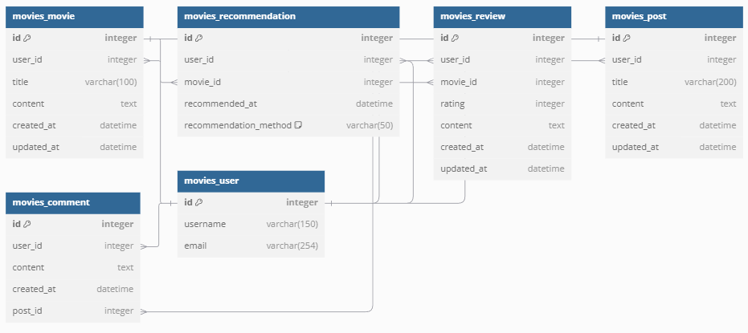

# Final_Project

## Day1 (2024-11-18)

### 구상
## ERD

---

1. 메인페이지

    - 트랜드 영화(TMDB API)

2. Nav-bar

    - 커뮤니티

    - 다크모드 토글

    - 영화 추천

        - 개봉예정작품

        - 현재상영작품

        - 최신작품예고(Youtube API)

    - 프로필

        - 위시리스트

        - 비밀번호 변경

        - 로그아웃

3. 페이지 구현

   - 커뮤니티 - 좋아요 / 싫어요

   - 상영작 리스트 + 개봉예정작 리스트

   - 최신 예고편(Youtube API)

   - 프로필

---

## Day2 (2024-11-19)

### 문제 발생

1. Django 와 Vue간 오류 발생

    - 로그인 문제가 해결되지 않음
  
    - Vue 재작성 및 Django 오류 검색

2. 코드가 너무 얽혀있어 문제 파악에 어려움을 겪음

3. 3시간 가량 디버깅 이후 프로젝트 재시작 계획

### 문제 해결

1. 팀원과의 토의
    - 단계적 개발의 필요성 대두
  
2. SSAFY 공용 문서 내 Final PJT 항목 중 단계적 개발의 중요성 항목 확인
   
3. 회원가입/로그인 -> API 처리 -> 이후 논의 순으로 진행

4. 하나씩 해결

### 진행 내용

1. Django 일부 완료

2. Vue - Navbar, MovieList, MovieDetail 완료

