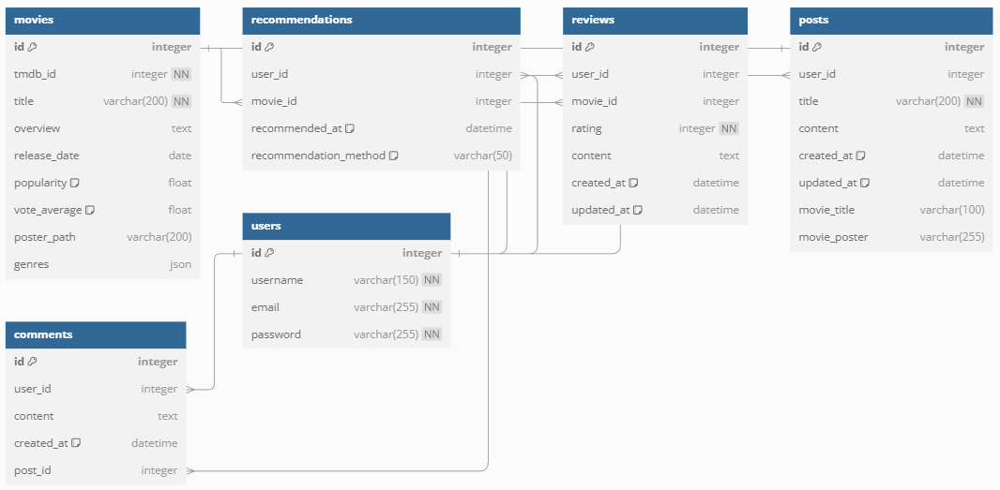

# Final_Project: Movie   Recommendation Website

## 0. 구상

1. 메인페이지

    - 트랜드 영화(TMDB API)

2. Nav-bar

    - 커뮤니티

    - 영화 추천

        - 개봉예정작품

        - 현재상영작품

        - 최신작품예고(Youtube API)

    - 프로필

        - 위시리스트

        - 로그아웃

3. 페이지 구현

   - 커뮤니티 - 좋아요

   - 상영작 리스트 + 개봉예정작 리스트

   - 최신 예고편(Youtube API)

   - 프로필

## 1. 팀원 정보 및 업무 분담 내역

- 팀장 (박태건)

    - 주요 업무: Vue.js 프론트엔드 개발, UI/UX 디자인, API 연동

    - 세부 업무: 화면 설계, 사용자 인터페이스 구현, 커뮤니티 기능 개발 등

- 팀원 (박민제)

    - 주요 업무: Django 백엔드 개발, 디자인 보조, API 연동

    - 세부 업무: 모델링, API 구축, 데이터베이스 저장, OpenAI 챗봇 구현 등

## 2. 목표 서비스 구현 및 실제 구현 정도

- 목표 서비스:

    영화 추천 웹사이트로, TMDb API와 연동하여 최신 영화 정보를 제공하고, 개인화된 추천 시스템을 구현합니다. 사용자 인터페이스는 Vue.js로 구축되고, 백엔드는 Django로 개발됩니다.

- 구현 정도:

    - Django: 사용자 인증, 영화 데이터 모델링, API 구축 완료

    - Vue.js: 메인 페이지, 영화 리스트, 영화 상세 페이지, 커뮤니티, 추천 검색창 등 기능 구현

    - 기타: TMDb API, Youtube API, OpenAI API 연동 완료, ERD 작성 완료

## 3. 데이터베이스 모델링 (ERD)

- Movie: 영화 정보를 저장하는 모델로, TMDb ID, 제목, 개봉일, 장르 정보 등 영화의 주요 정보를 저장합니다.

- Recommendation: 사용자에게 추천된 영화를 저장하는 모델로, 추천 방법(예: 사용자 기반 추천)을 함께 기록합니다.

- Review: 사용자가 작성한 영화 리뷰를 저장하는 모델로, 평점, 리뷰 내용 등을 포함합니다.

- Post: 커뮤니티 내 게시물을 저장하는 모델로, 제목과 내용, 작성일 등이 포함됩니다.

- Comment: 게시물에 달린 댓글을 저장하는 모델로, 댓글 작성자와 내용, 작성일 등이 포함됩니다.

## 4. 영화 추천 알고리즘에 대한 기술적 설명

- 기술적 설명:

    - TMDb API에서 최신 영화 데이터를 가져옴

    - 장르를 리스트에 저장하고 유사한 장르의 영화 추천

    - OpenAI 연동으로 챗봇 기능 사용

## 5. 핵심 기능에 대한 설명

1. 영화 추천

    - TMDb API와 ChatGPT API 를 사용하여 최신 영화 정보를 가져와 사용자에게 추천합니다.

2. 커뮤니티 기능

    - 사용자가 영화에 대해 좋아요를 표시하고, 영화에 대한 댓글을 작성할 수 있습니다.

3. 프로필 관리

    - 사용자는 자신의 프로필을 수정하고, 선호하는 영화를 추가하여 쉽게 접근할 수 있습니다.

## 6. 생성형 AI를 활용한 부분

- 챗봇

    - 챗봇을 통해 추천을 받을 수 있음

## 7. 기타

- 느낀 점 및 후기

    - 박태건 (팀장): 

    - 박민제 (팀원): 처음엔 쉽게 끝날 거로 생각했지만 역시 만만한 게 아니었습니다. 처음부터 차근차근 해야 하는데 너무 급하게 하다 보면 안 한 것 만 못하다는 걸 느꼈습니다. CSS 능력자와 함께여서 행복했습니다.

---